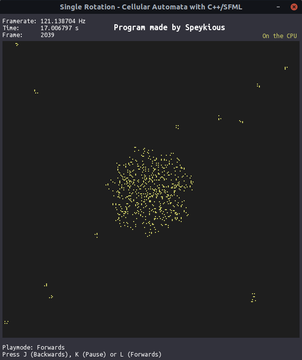

# Single Rotation with C++/SFML - on the CPU

Program that lets you observe the evolution of a grid state in a cellular automaton called **Single Rotation**.

Written using *C++/SFML* and runs on the *CPU*.

You can run the simulation forwards, pause, but also run it backwards thanks to the reversible property of the Single Rotation automaton, which would not be possible on the Game Of Life's automaton for example.

# Keys
* `J` : Run the simulation backwards
* `K` : Pause the simulation
* `L` : Run the simulation forwards
* `Escape` : Closes the program

# Side notes
The executable itself is `single_rotation.exe`. Just open a terminal in the `bin` file, write `./single_rotation.exe` and it should run.

However, I cannot guarantee that it will work for your device. I coded it on my **Linux Ubuntu 18.04** operating system.

It needs the fonts `ubuntumono-r.ttf` and `ubuntumono-b.ttf` to be in the `bin` file to display the texts properly.